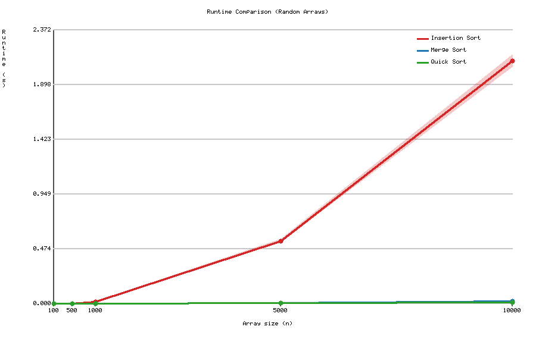
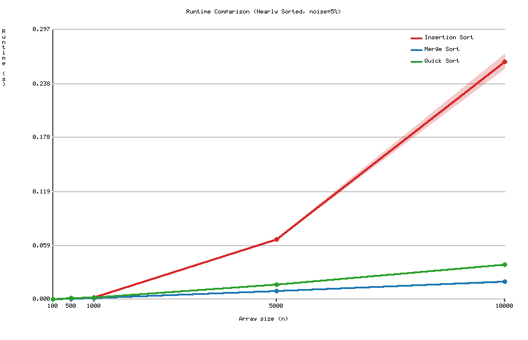

# Sorting_Assignment
Omer Ronen and Rotem Ben Yaish

## Selected Algorithms
- **Insertion Sort** (ID: 3) — O(n²) comparison-based sort
- **Merge Sort** (ID: 4) — O(n log n) divide-and-conquer sort
- **Quick Sort** (ID: 5) — O(n log n) average, in-place divide-and-conquer sort

## How to Run

```bash
python3 run_experiments.py -a 3 4 5 -s 100 500 1000 5000 10000 -e 1 -r 5
```

**Arguments:**
| Flag | Description |
|------|-------------|
| `-a` | Algorithm IDs (3=Insertion, 4=Merge, 5=Quick) |
| `-s` | Array sizes to test |
| `-e` | Experiment type: `1` = 5% noise, `2` = 20% noise |
| `-r` | Number of repetitions per experiment |

---

## Results

### Part B – Random Arrays



Merge Sort and Quick Sort perform significantly faster than Insertion Sort on random arrays.
Insertion Sort grows at O(n²) — at n=10,000 it takes ~2.1 seconds, while Merge Sort and Quick Sort finish in ~0.02s and ~0.01s respectively.
This confirms the theoretical gap between O(n²) and O(n log n) algorithms as input size grows.

---

### Part C – Nearly Sorted Arrays (5% noise)



With only 5% of elements swapped, Insertion Sort improves dramatically — dropping from ~2.1s to ~0.26s at n=10,000.
This is because Insertion Sort is naturally efficient on nearly sorted data (each element needs very few shifts).
Quick Sort, however, slows down relative to Merge Sort on nearly sorted input, because its pivot selection (last element) leads to more unbalanced partitions.
Merge Sort remains stable and fast regardless of the initial order.
